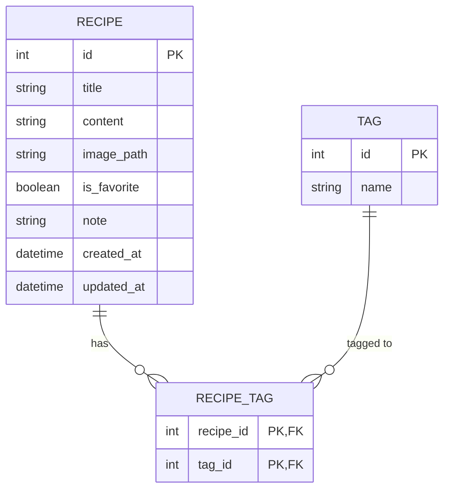

# 資料庫設計 (Database Design)

本文件根據功能需求與流程圖，定義系統的資料庫架構（SQLite），並說明各資料表的用途與關聯。

## 1. ER 圖（實體關係圖）

我們主要需要「食譜 (RECIPE)」與「標籤 (TAG)」兩個主表，因為一個食譜可以有多個標籤，一個標籤也可以標記多個食譜，所以我們需要一個中介表「食譜_標籤關聯 (RECIPE_TAG)」來實現多對多 (Many-to-Many) 關係。

## 2. 資料表詳細說明

### `recipes` (食譜表)
負責儲存食譜的主要資訊，包含標題、內容、筆記與最愛狀態。

| 欄位名稱 | 資料型別 | 必填 | 預設值 | 說明 |
| :--- | :--- | :---: | :--- | :--- |
| `id` | INTEGER | 是 | (PK) Auto | 唯一識別碼，自動遞增 |
| `title` | TEXT | 是 | - | 食譜標題 |
| `content` | TEXT | 否 | NULL | 食材清單與步驟說明 |
| `image_path` | TEXT | 否 | NULL | 食譜圖片的儲存路徑 |
| `is_favorite`| BOOLEAN | 是 | 0 (False) | 是否加入我的最愛 |
| `note` | TEXT | 否 | NULL | 個人的烹飪筆記與試錯紀錄 |
| `created_at` | DATETIME | 是 | Current | 建立時間 |
| `updated_at` | DATETIME | 是 | Current | 最後更新時間 |

### `tags` (標籤表)
儲存系統中所有的分類標籤名稱（如：中式、甜點、備餐）。

| 欄位名稱 | 資料型別 | 必填 | 預設值 | 說明 |
| :--- | :--- | :---: | :--- | :--- |
| `id` | INTEGER | 是 | (PK) Auto | 唯一識別碼，自動遞增 |
| `name` | TEXT | 是 | - | 標籤名稱 (設定 UNIQUE 確保不重複) |

### `recipe_tags` (食譜標籤關聯表)
中介資料表，用於記錄哪個食譜加上了哪個標籤。

| 欄位名稱 | 資料型別 | 必填 | 說明 |
| :--- | :--- | :---: | :--- |
| `recipe_id` | INTEGER | 是 | 關聯 `recipes.id` (Foreign Key) |
| `tag_id` | INTEGER | 是 | 關聯 `tags.id` (Foreign Key) |

> 註：`recipe_id` 與 `tag_id` 共同組成複合主鍵 (Composite Primary Key)。

## 3. SQL 建表語法
完整的建表語法請參考 `database/schema.sql` 檔案。

## 4. Python Model 程式碼
根據架構文件的決策，採用 SQLAlchemy ORM，相關檔案已建立於 `app/models/` 之中：
- `app/models/__init__.py`: 初始化 db 物件
- `app/models/recipe.py`: 食譜模型 (Recipe) 與中介表
- `app/models/tag.py`: 標籤模型 (Tag)
