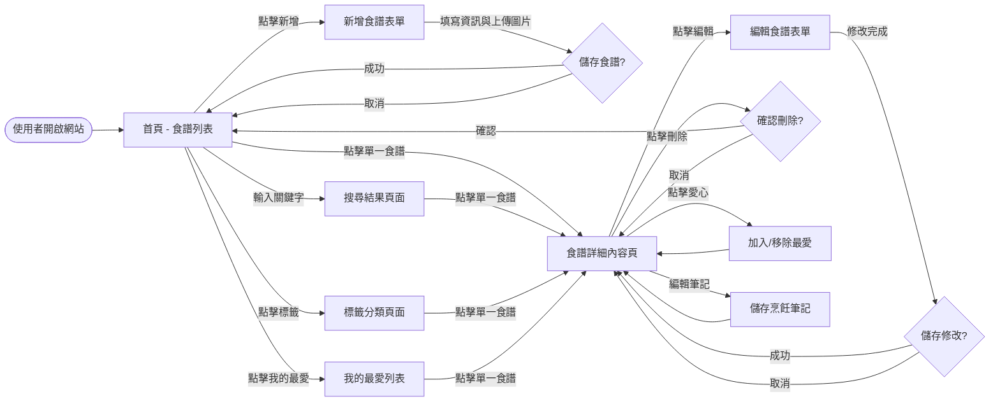
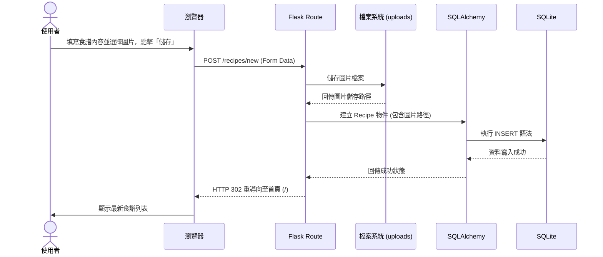

# 流程圖設計 (Flowchart)

本文件根據產品需求文件 (PRD) 與系統架構設計 (ARCHITECTURE)，視覺化使用者的操作流程與系統內部的資料流動。

## 1. 使用者流程圖 (User Flow)

此流程圖展示使用者進入系統後，可以進行的各項操作路徑。包含首頁瀏覽、搜尋、分類篩選、以及食譜的 CRUD (新增、查看、修改、刪除) 流程。

## 2. 系統序列圖 (Sequence Diagram)

此圖以「**使用者新增包含圖片的食譜**」為例，展示前端瀏覽器、後端 Flask 路由、資料庫模型與 SQLite 之間的互動時序。

## 3. 功能清單對照表

以下整理了所有的核心功能對應的 URL 路徑與 HTTP 方法，為接下來的路由設計提供明確的指引（註：由於 HTML 表單原生僅支援 GET 與 POST，故編輯與刪除皆採用 POST 方法實作）。

| 功能項目 | 說明 | HTTP 方法 | URL 路徑 |
| :--- | :--- | :---: | :--- |
| **食譜列表** | 顯示所有食譜 (首頁) | `GET` | `/` |
| **新增食譜 (表單)** | 顯示新增食譜的頁面 | `GET` | `/recipes/new` |
| **新增食譜 (儲存)** | 接收表單資料並存入資料庫 | `POST` | `/recipes/new` |
| **食譜詳細內容** | 查看單一食譜的圖文與步驟 | `GET` | `/recipes/<id>` |
| **編輯食譜 (表單)** | 顯示編輯食譜的頁面 | `GET` | `/recipes/<id>/edit` |
| **編輯食譜 (儲存)** | 接收修改後的資料並更新 | `POST` | `/recipes/<id>/edit` |
| **刪除食譜** | 從資料庫中刪除該食譜 | `POST` | `/recipes/<id>/delete` |
| **標籤篩選** | 顯示特定標籤下的所有食譜 | `GET` | `/tags/<tag_name>` |
| **關鍵字搜尋** | 依據輸入的關鍵字顯示結果 | `GET` | `/search` |
| **我的最愛列表** | 顯示已收藏的食譜 | `GET` | `/favorites` |
| **切換我的最愛** | 將食譜加入或移除我的最愛 | `POST` | `/recipes/<id>/favorite` |
| **更新烹飪筆記** | 儲存該食譜專屬的烹飪筆記 | `POST` | `/recipes/<id>/note` |
